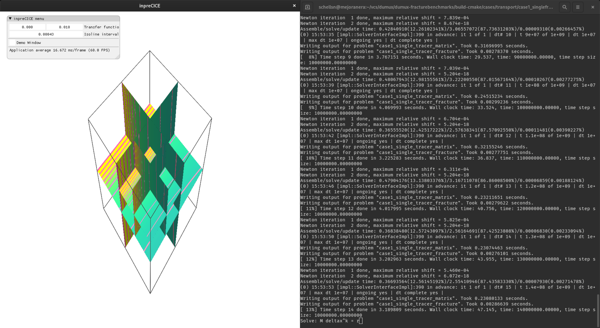

# inpreCICE

In situ visualization for *Verification benchmarks for single-phase flow in three-dimensional fractured porous media*
(see [Paper](https://arxiv.org/pdf/2002.07005.pdf) and
[Call for Participation](https://arxiv.org/pdf/1809.06926.pdf)).
Coupling to any solver is realized with the [*preCICE* framework]().

## Usage

Compile the program and create links to the respective `release` and `debug` binaries by executing the following commands in the base directory of the repository:

    $ make all
    $ ln -s build/debug/inpreCICE dinpreCICE
    $ ln -s build/release/inpreCICE inpreCICE

Afterwards the program can be executed from the base directory with `./dinpreCICE` or `./inpreCICE`.

### Note

To build the program, the following dependencies are required on your system:

- GLFW library
- Boost C++ libraries
- FreeImage library
- GPU and driver that support OpenGL >= 3.3
- C11 and C++14 compatible compilers (tested with cc and g++ version 9.3.0)

## Included Libraries

This work is based on the [*MVR* volume renderer](https://github.com/SteScheller/my_volume_renderer) and includes code of the following libraries:

- [preCICE](https://www.precice.org/)
- [ImGui](https://github.com/ocornut/imgui)
- [gl3w](https://github.com/skaslev/gl3w)
- [JSON for modern C++](https://github.com/nlohmann/json)
- [LearnOpenGL](https://github.com/JoeyDeVries/LearnOpenGL) (shader convenience class)

## License

This work is licensed under the [GPLv3](./LICENSE) (or later).
The included libraries are distributed under the follwing licenses:

- preCICE: [LGPLv3](./LICENSE_LGPLv3)
- ImGui: [MIT](./LICENSE_MIT)
- gl3w: [UNLICENSE](./LICENSE_UNLICENSE)
- JSON for modern C++: [MIT](./LICENSE_MIT)
- LearnOpenGL: [CC BY-NC 4.0](./LICENSE_CC_BY-NC_4)

We thank all contributers of the according free software packages!

